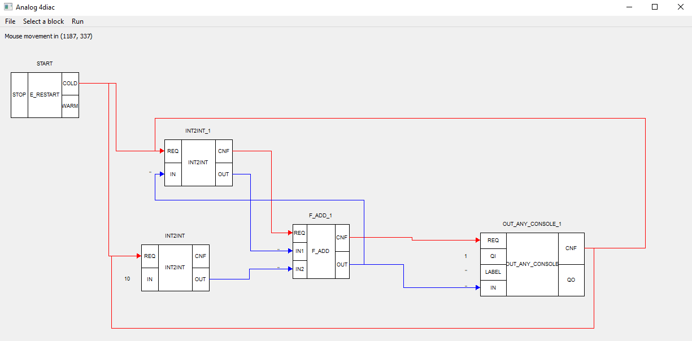
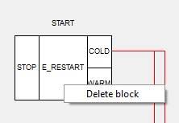
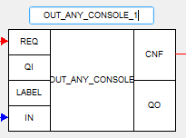
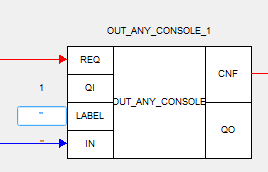

# Analog_4diac_IDE

## Description
This application is designed to create projects according to the IEC61499 standard. It is created for educational purposes as an analogue of the 4diac_ide application with the ability to connect to the forte runtime environment

## Installation
To install dependencies, you need choose python interpreter and write from the terminal in the project folder:  
```pip install -r requirements.txt```  

## Usage
After start main_window.py you can see a main window of IDE.

1. Operations with blocks and links
   - To add a block, click on the "Select a Block" drop-down list and select the desired one.
   - To delete a block, right-click on the central rectangle of the block and confirm your selection.
   - To drag a block, press and hold the left mouse button. 
   - To create a connection, press and hold the left mouse button on the exit rectangle and swipe it to the entrance rectangle. 
   - To move the connection, hover the cursor over the changeable communication line so that it changes the icon and click the left mouse button. 
   - To delete a connection, hover the cursor over the changeable communication line so that it changes the icon, right-click and confirm your choice.

2. Operations with fields to be filled in
   - To change the name of the side, click on it with the left mouse button.
   - In order to set values for the IN, LABEL and others fields, right-click on the ' ' next to them. 

3. Opening and saving a project
   - To open the project: File => Open => Select your file.xml.
   - To save your project to the file from which it was opened: File => Save.
   - To save your project with choosing file_path: File => Save as XML.
   - To Create file.fboot: File => Create fboot file.
4. Deploying
   - In order to run your scheme, you need to first run forte.exe and then: Run => Deploy.

The project_files folder is needed to store the boot file for deploy and to save new projects by default

Screenshots:
- 
-  
- 
- 
-  
- 
- 
## Support
To add your blocks, 
1. in custom_blocks.py you need:
   - Declare the class of your block inherited from BaseBlock by analogy with classes from the same file. 
   - Write the create_block{your_block} function by analogy with the same functions for already created files.
   - Add the (block_name: block_class) to the classes dictionary in the add_block_classes function.
   - Add an instance count of your class to the count dictionary in the count_blocks function
2. in main_window.py you need:
   - Create create_action_{your_block}, connect and add it to self.menu_blocks by analogy with other blocks in the create_actions method
## Authors
sfetisoff, DAKudryashev
